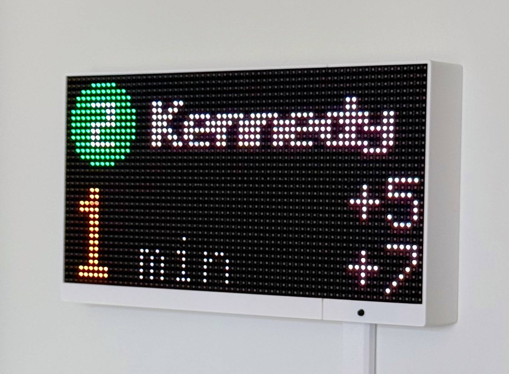
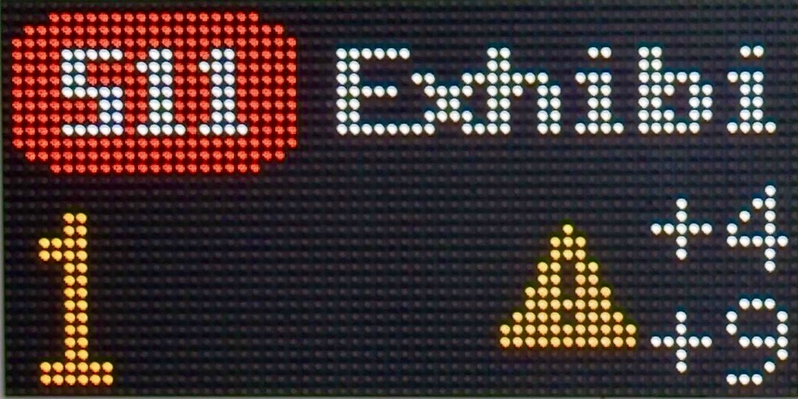
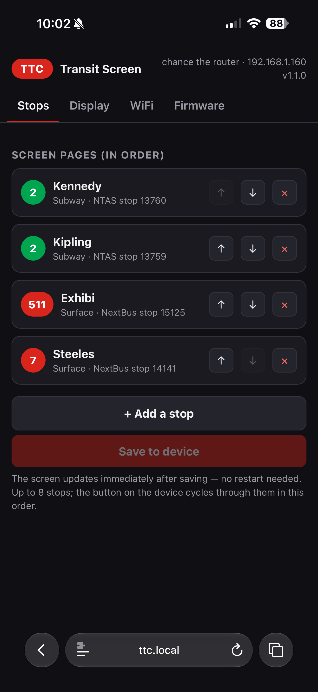
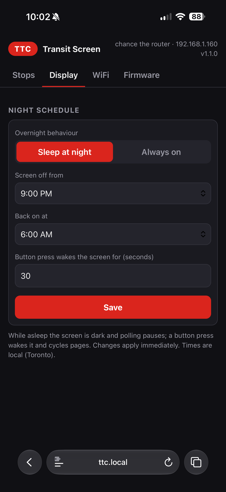
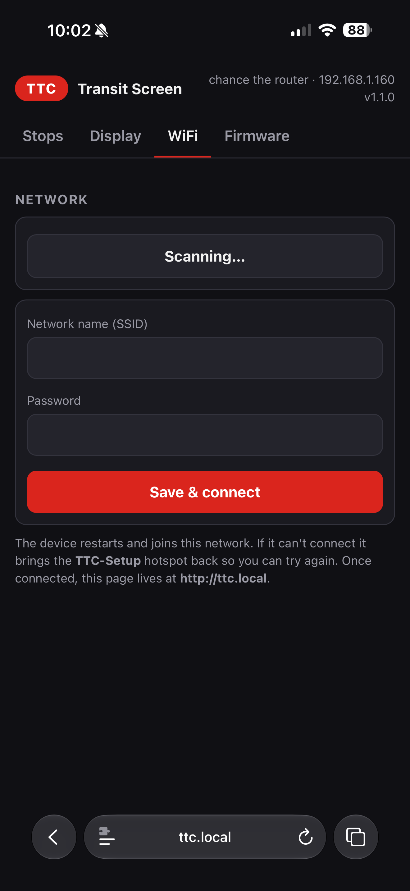

# TTC Transit Screen



An open-source, Wi-Fi-connected TTC arrival display built around an ESP32-S3 and a 64×32 P4 HUB75 RGB LED panel. It shows the next arrivals for up to eight subway, streetcar, or bus stops, includes line-alert indicators, and is configured from a phone-friendly local web app.

This is an independent community project. It is not affiliated with, endorsed by, or supported by the Toronto Transit Commission. Transit data can be delayed, incomplete, or unavailable; do not rely on this display for safety-critical travel decisions.

## What it does

- Shows three upcoming arrivals on a bright 64×32 RGB matrix.
- Supports subway platforms through TTC NTAS and surface routes through the public NextBus/UMO feed.
- Shows a warning triangle when TTC's live-alert feed reports an active line issue.
- Stores up to eight pages and cycles through them with an optional button.
- Hosts a captive setup portal and a responsive local configuration page.
- Sleeps the panel and pauses feed polling on a configurable overnight schedule.
- Supports local over-the-air firmware updates.
- Requires no cloud account, application server, or hardcoded stop selection.



*The 64×32 layout showing a surface route, destination, alert state, and arrival minutes.*

## Supported boards

| PlatformIO environment | Memory | Status |
| --- | --- | --- |
| `esp32-s3-n16r8` | 16 MB flash, 8 MB octal PSRAM (`qio_opi`) | Default; tested on hardware |
| `esp32-s3-n8r2` | 8 MB flash, 2 MB quad PSRAM (`qio_qspi`) | Clean-build tested; not yet tested on hardware |

Both targets use the same 44-pin ESP32-S3 board layout, HUB75 wiring, firmware, and web app. Clone pin labels and power paths can vary, so compare your board with the wiring table before applying power.

## Bill of materials

| Qty | Item | Notes |
| ---: | --- | --- |
| 1 | [ESP32-S3 N16R8/N8R2 development board](https://www.aliexpress.com/item/1005006418608267.html) | N16R8 is the tested and default choice |
| 1 | [P4 indoor 64×32, 256×128 mm, 1/16-scan HUB75 panel](https://www.aliexpress.com/item/1005007439197222.html) | This geometry and scan rate are compile-time constants |
| 1 | Quality regulated 5 V / 3 A USB-C supply | Used by the tested USB-powered topology below |
| 1 | Low-resistance USB-C cable rated for at least 3 A | A marginal cable is a common source of resets and display corruption |
| 1 | HUB75 ribbon cable | Often included with the panel |
| 1 set | Female-to-female jumper wires or a purpose-built wiring harness | Keep signal wiring short and secure |
| 6 | M3×6 machine screws | Engage the panel's threaded inserts through the enclosure |
| 1 | [Momentary tact switch](https://www.aliexpress.com/item/1005007078720195.html) | Optional; the linked assortment is simply the kit used during development |
| 1 | Printed enclosure | Fusion archive and two printable STLs are included under [`hardware/enclosure`](hardware/enclosure/) |

A direct 5 V / 5 A supply, suitable wiring, and a fused distribution method are recommended as a fallback if the tested USB topology is unstable with your particular board or display.

## Power: read before wiring

The tested unit is powered through the ESP32's USB-C connector. The board's `5Vin` pin then supplies 5 V to the panel. At the fixed brightness value of 96, the measured normal workload was under 1 A because most pixels are black. That observation is not a worst-case rating: startup current, test patterns, different panels, USB cables, and board clones can draw more or expose a weak power path.

- Use a reputable regulated 5 V / 3 A USB-C supply and a short, low-resistance cable.
- Check the ESP32 board, connector, wiring, and panel for excess heat during initial testing.
- Watch for brownouts, spontaneous resets, flicker, or corrupted pixels.
- Do not feed external 5 V into `5Vin` while USB 5 V is also connected. Back-feeding can damage the board, computer, or supply.
- Never power the panel from the ESP32's 3.3 V pin or through its voltage regulator.

If USB power is not stable, use a regulated 5 V / 5 A supply split directly to the panel power input and the ESP32 `5Vin`, with all grounds common. Disconnect that external 5 V before connecting an ordinary powered USB cable for flashing.

## HUB75 wiring

The firmware uses one fixed pin map. The table follows the two columns of a standard HUB75 input connector; confirm the `IN` connector and key orientation on your panel.

| HUB75 signal | ESP32-S3 GPIO | HUB75 signal | ESP32-S3 GPIO |
| --- | ---: | --- | ---: |
| R1 | 4 | G1 | 1 |
| B1 | 5 | G2 | 2 |
| R2 | 6 | B (row address) | 42 |
| B2 | 7 | D | 41 |
| A | 15 | LAT / STB | 40 |
| C | 16 | E | GND |
| CLK | 17 | GND | GND |
| OE | 18 | GND | GND |

Connect every panel ground on the HUB75 header to ESP32 ground. Connect panel power `VCC` to the board's `5Vin` only when using the tested USB topology, and panel power ground to the same common ground. The 32-row, 1/16-scan panel does not use address line E, so E is tied to ground.

For the optional page/reset button, connect the momentary switch between GPIO21 and GPIO47. GPIO21 is the active-low input; GPIO47 is driven LOW as a virtual ground because of the compact harness layout. This virtual ground is only for the switch's tiny current—never connect a display, LED, or other load to GPIO47.

Without the button, the device still provisions, fetches data, sleeps on schedule, and can be managed through the web app. Only the first configured page is shown, and physical factory reset is unavailable.

## Prebuilt firmware

The [latest GitHub release](https://github.com/romeluis/TTC-Transit-Screen/releases/latest) includes ready-to-flash binaries for both supported memory variants. Choose the file whose board name exactly matches your ESP32-S3:

| File suffix | Use |
| --- | --- |
| `esp32-s3-n16r8-factory.bin` | First USB installation on the tested 16 MB flash / 8 MB PSRAM board |
| `esp32-s3-n16r8-ota.bin` | Firmware-tab update for the tested N16R8 board |
| `esp32-s3-n8r2-factory.bin` | First USB installation on the compile-supported 8 MB flash / 2 MB PSRAM board |
| `esp32-s3-n8r2-ota.bin` | Firmware-tab update for the compile-supported N8R2 board |

The `factory` images contain the bootloader, partition table, and application and are written at address `0x0`. Install [esptool](https://docs.espressif.com/projects/esptool/en/latest/esp32s3/installation.html), connect the board over USB, then run:

```sh
python -m esptool --chip esp32s3 --port /dev/your-port write-flash 0x0 ttc-transit-screen-v1.1.0-esp32-s3-n16r8-factory.bin
```

Replace the port and filename for your board. If the board does not enter download mode automatically, hold BOOT, tap RESET, start the command, then release BOOT. The release also includes `SHA256SUMS.txt` so downloads can be verified before flashing.

## Build and flash

Install [PlatformIO Core](https://docs.platformio.org/en/latest/core/installation/index.html), clone this repository, and run the commands from its root.

```sh
# Default, hardware-tested N16R8 target
pio run -e esp32-s3-n16r8
pio run -e esp32-s3-n16r8 -t upload

# Compile-supported N8R2 target
pio run -e esp32-s3-n8r2
pio run -e esp32-s3-n8r2 -t upload

# Optional serial diagnostics
pio device monitor -b 115200
```

The pre-build script compresses `web/index.html` and the station catalog into `include/web_page.h`; the generated header is intentionally ignored by Git. Use the native USB connector labelled `USB` when the board exposes both native USB and UART connectors. If automatic upload does not start, hold BOOT, tap RESET, begin the upload, then release BOOT.

### Fixed build-time settings

This project intentionally has no runtime brightness control. The tested value is `PANEL_BRIGHTNESS = 96` in [`src/config.h`](src/config.h). Change it at source level only, then rebuild and re-check current draw and temperature.

The following hardcoded values are intentional and collected here so they are easy to review before a build:

| Setting | Compiled value |
| --- | --- |
| Panel | 64×32 pixels, 1/16 scan; shared pins listed above |
| Brightness | 96 of 255 |
| Maximum pages | 8 |
| Arrival polling | 25 seconds per feed, staggered by 3 seconds |
| Alert polling | 120 seconds |
| Stale-data threshold | 90 seconds |
| HTTP timeout | 10 seconds |
| Wi-Fi connection timeout | 45 seconds |
| Reconnect backoff | 5–60 seconds |
| Portal fallback after lost Wi-Fi | 5 minutes |
| Stored-network retry while in portal | 2 minutes |
| Physical factory-reset hold | 10 seconds |
| Setup network | Open SSID `TTC-Setup` |
| Local hostname | `ttc` / `http://ttc.local` |
| Timezone | `America/Toronto` POSIX rules; NTP via `pool.ntp.org` and `time.google.com` |
| Default sleep schedule | 9 PM–6 AM local time; 30-second button wake |
| Subway feed | `https://ntas.ttc.ca/api/ntas/get-next-train-time/` |
| Surface feed | `https://retro.umoiq.com/service/publicJSONFeed` with agency `ttc` |
| Alert feed | `https://alerts.ttc.ca/api/alerts/live-alerts` |

Stops and the active sleep schedule are not hardcoded; they are stored in the device's NVS after configuration.

## First-time setup

1. Power the assembled device and wait for the `WiFi Setup` screen.
2. Join the open Wi-Fi network `TTC-Setup` from a phone or computer.
3. Open the captive-portal prompt. If it does not appear, browse to the IP shown on the panel.
4. Open the **WiFi** tab, scan or type the network name, enter its password, and choose **Save & connect**.
5. After restart, browse to [http://ttc.local](http://ttc.local). If mDNS is unavailable on your network, use the IP shown in the web app or serial log.
6. In **Stops**, add up to eight pages in the order you want them displayed, then choose **Save to device**.
7. In **Display**, keep the default overnight schedule or set your preferred local hours and button wake time.

Subway stops come from the embedded station/platform catalog. Streetcar and bus selectors are loaded through the ESP32's NextBus proxy and therefore require internet access. A fresh device contains no default stops or personal location data.

## Web app

<p align="center"></p>

*The Stops tab adds, removes, reorders, and saves up to eight display pages.*

<p align="center"></p>

*The Display tab configures the panel's overnight sleep window and button wake time. It does not include brightness control.*

<p align="center"></p>

*The Wi-Fi tab scans for a network, saves credentials, and reconnects the device.*

## Daily operation

- A short button press cycles pages in the configured order.
- During the sleep window, the first press wakes the panel without changing page. Further presses while awake cycle pages and extend the wake timer.
- Holding the button for 10 seconds after boot wipes Wi-Fi credentials, stops, and screen settings, then restarts the setup portal.
- If Wi-Fi drops, the firmware retries with exponential backoff. After a prolonged outage it reopens the setup portal while continuing to retry stored credentials.
- Feed polling pauses while the screen is asleep and resumes immediately on wake.

## Local firmware update

Build the firmware for the exact memory variant installed. In the web app's **Firmware** tab, upload:

- `.pio/build/esp32-s3-n16r8/firmware.bin`, or
- `.pio/build/esp32-s3-n8r2/firmware.bin`.

The ESP32 writes to the inactive OTA slot and restarts only after a successful upload. The firmware page is unauthenticated; read the security section before enabling this device on a shared network.

## Enclosure

The enclosure source and both printable halves are in [`hardware/enclosure`](hardware/enclosure/). The assembled STL bounds are approximately **260.5 × 142.5 × 36 mm**. The fit was tested in PLA. A reasonable starting profile is 0.2 mm layers, three walls, and 20% infill, with each half laid flat on its broad back face.

The enclosure has six panel mounting holes for M3×6 screws. It is provided as-is by a hobbyist designer: printer calibration, panel revisions, cable strain relief, and tolerances vary. Test-fit before final assembly, do not overtighten the panel inserts, and contributions improving the design are welcome.

## Architecture and repository layout

| Path | Purpose |
| --- | --- |
| `src/main.cpp` | Network state machine, scheduling, button handling, sleep/wake behavior |
| `src/transit_data.cpp` | TTC/NextBus fetching and JSON parsing |
| `src/display.cpp` | Shared 64×32 HUB75 rendering |
| `src/settings.cpp` | NVS-backed stops, Wi-Fi credentials, and screen schedule |
| `src/webconfig.cpp` | Captive portal, local HTTP API, feed proxy, reboot, and OTA |
| `web/` | Embedded responsive configuration UI and public station catalog |
| `tools/build_web.py` | Deterministic web-asset compression before each firmware build |
| `hardware/enclosure/` | Fusion archive, printable STLs, and print notes |

The device connects directly to public transit feeds, parses only the fields it needs, stores runtime configuration in NVS, renders the active page to the HUB75 panel, and serves the web app over the local network. No companion service is required.

### Data sources

- TTC NTAS next-train endpoint for subway platform estimates
- NextBus/UMO public JSON feed for bus and streetcar predictions
- TTC live-alert endpoint for line-level disruption indicators
- TTC GTFS-derived platform codes in the embedded station catalog

These are public endpoints, not stable contracts. Upstream schema, availability, stop codes, or access policies may change without notice.

## Security model

> **Trusted LAN only.** This firmware is designed for a private network, not an untrusted, guest, school, workplace, or internet-exposed network.

- The `TTC-Setup` access point is open and its captive portal has no authentication.
- Wi-Fi credentials are submitted over plaintext local HTTP and stored unencrypted in ESP32 NVS.
- The status endpoint and page expose the connected SSID and local IP address.
- Stop/schedule/Wi-Fi configuration, reboot, and OTA endpoints are unauthenticated.
- HTTPS certificate validation is disabled for the public transit feeds, so transit responses are not protected against an active network attacker.

Do not port-forward the device, expose it through a public reverse proxy, or place it on a network where untrusted clients can reach it. A separate trusted IoT VLAN is a good deployment choice. See [`SECURITY.md`](SECURITY.md) for the full disclosure and reporting guidance.

## Troubleshooting

| Symptom | Checks |
| --- | --- |
| Reboots, flicker, or random pixels | Use a better 5 V supply/cable, shorten power leads, tie all grounds together, and try the direct 5 V / 5 A split topology |
| Panel is blank | Confirm HUB75 `IN` orientation, OE/LAT/CLK wiring, common ground, panel power, and the 1/16-scan 64×32 panel type |
| Colours or rows are wrong | Recheck R/G/B and A/B/C/D wires; confirm E is grounded and that your panel is not a different scan geometry |
| `TTC-Setup` does not appear | Hold the optional button for 10 seconds after boot, or erase flash over USB and reflash |
| `ttc.local` does not resolve | Use the device IP from serial output or your router's client list; some networks do not pass mDNS |
| Streetcar/bus picker fails | Confirm internet access; the browser relies on the ESP32 proxy because the upstream feed has no browser CORS support |
| No or stale arrivals | Verify stop codes, upstream service status, Wi-Fi signal, and serial diagnostics; predictions are controlled by the external feeds |
| OTA rejects a file | Rebuild for the exact N16R8/N8R2 target and upload that environment's `firmware.bin` |

## Release verification

CI clean-builds both memory variants. Before distributing hardware, repeat the N16R8 smoke test: cold boot/display initialization, first-time provisioning, stop fetching, disconnect/reconnect, scheduled sleep and button wake, page cycling, 10-second factory reset, and OTA update. Treat N8R2 as compile-tested until the same checklist has been completed on physical N8R2 hardware.

## License

This repository—including firmware, web assets, documentation, photos, and enclosure files—is released under the [MIT License](LICENSE).

Created and maintained by [@romeluis](https://github.com/romeluis).
